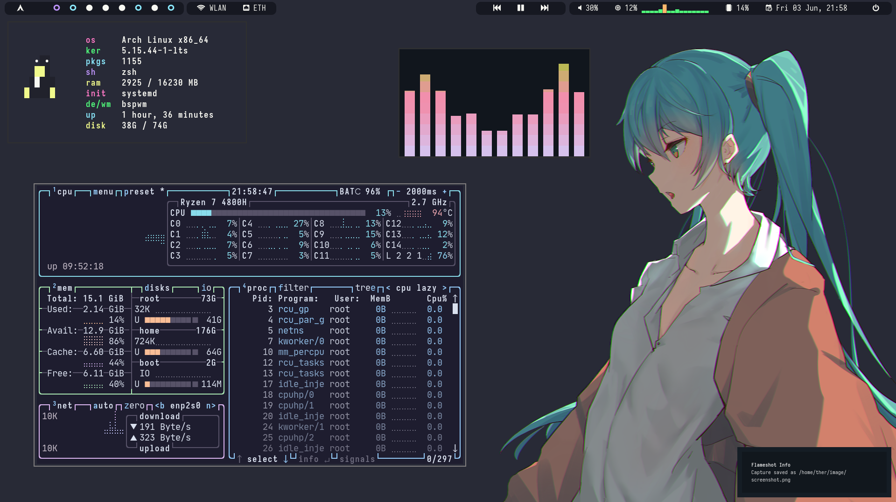

# My dotfiles

   
   
    
   

## Screenshots

## Information

- OS: [Arch-Linux](https://archlinux.org)
- WM: [bspwm](https://wiki.archlinux.org/title/Bspwm)
- Bar: [polybar](https://github.com/polybar/polybar)
- Terminal: [Kitty](https://github.com/kovidgoyal/kitty)
- Shell: [zsh](https://www.zsh.org)
- Editor: [Neovim](https://neovim.io), [Vscode](https://code.visualstudio.com)
- Document viewer: [Zathura](https://wiki.archlinux.org/title/Zathura)
- launcher: [rofi](https://github.com/davatorium/rofi)
- System monitor: btop, htop
- Fetch tool: rxfetch
- Shot tool: flameshot
- Wallpaper tool: nitrogen
- Compositor: picom-ibhagwan-git
- Power manager: xfce4-power-manager
- Font: ttf-inconsolata
- Emoji: libxft-bgra, ttf-joypixels
- Dotfiles manager: [Chezmoi](https://www.chezmoi.io/)
